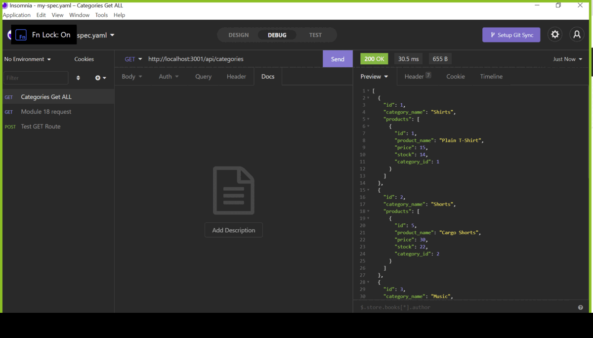

# Social-Network-BackEnd

## Table Of Contents
* [Description](#description)
* [Development](#usage)
* [Technologies Used](#technologies-used)
* [Future Deployment](#future-deployement)
* [Contact](#contact)
----------------------------
## Description
This is a ready to use Social Network back-end. 

## User Story

```md
AS A social media startup
I WANT an API for my social network that uses a NoSQL database
SO THAT my website can handle large amounts of unstructured data
```
## Acceptance Criteria

```md
GIVEN a social network API
WHEN I enter the command to invoke the application
THEN my server is started and the Mongoose models are synced to the MongoDB database
WHEN I open API GET routes in Insomnia Core for users and thoughts
THEN the data for each of these routes is displayed in a formatted JSON
WHEN I test API POST, PUT, and DELETE routes in Insomnia Core
THEN I am able to successfully create, update, and delete users and thoughts in my database
WHEN I test API POST and DELETE routes in Insomnia Core
THEN I am able to successfully create and delete reactions to thoughts and add and remove friends to a user’s friend list
```
---------------------------
## Development
Many upgrades to come. Currently our delete button is having technical defficulties, button will be removed until bug is found. Deployment will not come any later than July, 2021.

---------------------------
## Technologies used
- JavaScript
- MongoDB
- Mongoose
- Express
- NoseJS

---------------------------
## Deployment
* To test the app on your local machine 
`npm install`
`npm run develop` or `npm start`

`You may use insomnia to test the routes.`
---------------------------
## Gifs and pics for the app
* Testing Categories


* Testing  Tag 


* Product get by ID


* Create new product


* New Product:


## Contact: 
* If you have any questions or concerns please reach out to nellia.f.charlton@gmail.com 
